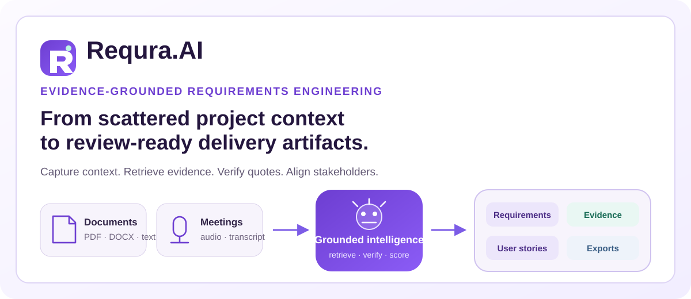
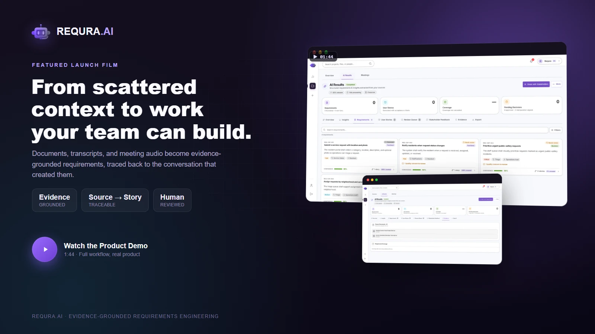
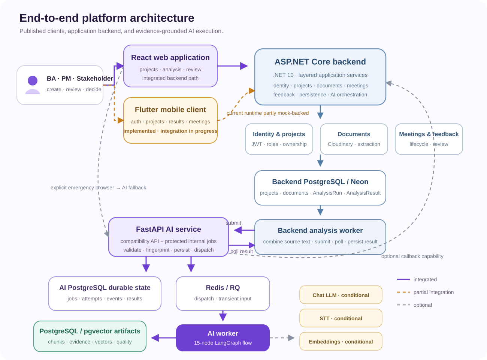
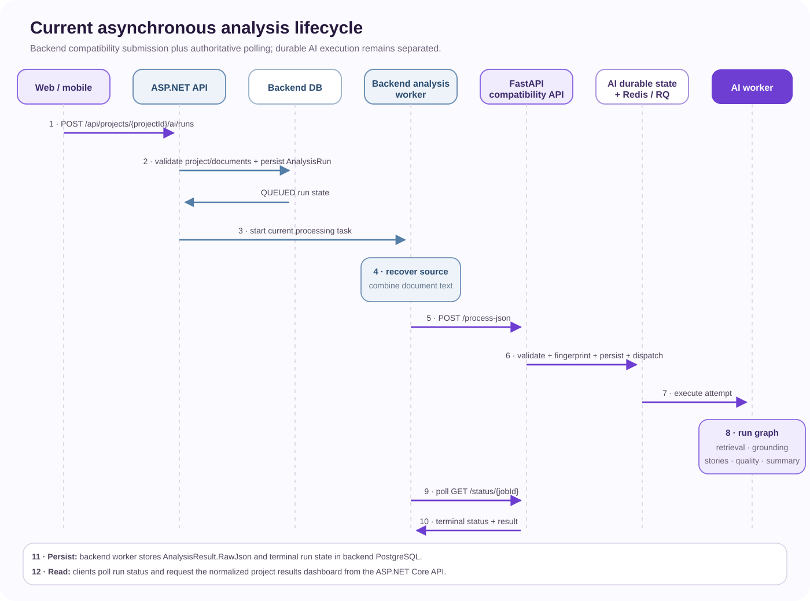
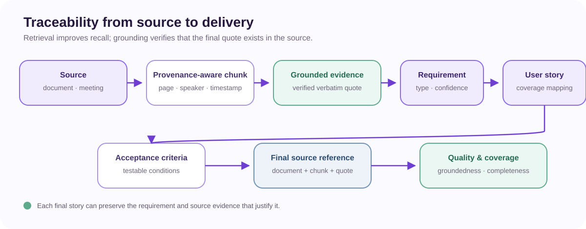

<picture>
  <source media="(prefers-color-scheme: dark)" srcset="./assets/hero-dark.svg">
  <source media="(prefers-color-scheme: light)" srcset="./assets/hero-light.svg">
  
</picture>

<p align="center">
  <a href="https://requra-demo-rust.vercel.app/demo"><strong>Open Live Demo</strong></a>
  &nbsp;·&nbsp;
  <a href="https://github.com/Requra/frontend"><strong>Frontend</strong></a>
  &nbsp;·&nbsp;
  <a href="https://github.com/Requra/backend"><strong>Backend</strong></a>
  &nbsp;·&nbsp;
  <a href="https://github.com/Requra/mobile"><strong>Mobile</strong></a>
  &nbsp;·&nbsp;
  <a href="https://github.com/Requra/ai-pipeline"><strong>AI Pipeline</strong></a>
</p>
<p align="center">
  <a href="https://vrqplen1gy.apidog.io/"><strong>API Documentation</strong></a>
  &nbsp;·&nbsp;
  <a href="https://www.figma.com/design/t3LvbLJ0QiAynzr6mxsifi/UI-Shared?node-id=0-1&t=3JyWES2RjWpm9pKi-1"><strong>Figma Product Design</strong></a>
</p>

## Featured launch film

<a href="https://github.com/Requra/.github/releases/download/launch-film/requra-flagship-demo-1080p.mp4">
  
</a>

<p align="center"><sub>104 seconds · real product UI, real mixed-source project · <a href="https://github.com/Requra/.github/releases/tag/launch-film">also available in 4K</a></sub></p>

## What Requra.AI does

Requra.AI turns fragmented project knowledge—documents, notes, transcripts, meeting audio, and stakeholder context—into structured requirements, user stories, acceptance criteria, executive summaries, evidence, quality findings, and delivery-ready export data.

Unlike a generic LLM wrapper, the AI workflow retrieves source support and then performs a separate grounding step that verifies final evidence quotes against the original chunks. Business analysts and product teams can review results, invite stakeholders, resolve feedback, and keep delivery artifacts connected to their source.

<table>
<tr>
<td width="33%" valign="top">

### Unstructured context

- PDF and DOCX files
- Notes and text
- Meeting transcripts
- Audio when STT is configured
- Project and meeting context

</td>
<td width="34%" valign="top">

### Grounded intelligence

- Parsing and chunking
- Requirement extraction
- Deduplication and classification
- BM25 or optional hybrid retrieval
- Evidence grounding and quality gates

</td>
<td width="33%" valign="top">

### Delivery artifacts

- Structured requirements
- User stories and criteria
- Executive summaries
- Source references and coverage
- ClickUp tasks, Jira-compatible rows, and spreadsheet exports

</td>
</tr>
</table>

## Product experience

| Surface | Current experience |
| --- | --- |
| **Project workspaces** | Create, organize, search, inspect, edit, and remove project workspaces. |
| **Asynchronous analysis** | Submit project sources, follow queued/processing/terminal states, and render normalized results. |
| **Evidence and traceability** | Review source quotes, references, requirement confidence, coverage, and quality findings. |
| **Stakeholder review** | Invite reviewers, collect feedback, and track resolution state. |
| **Meeting workflows** | Schedule, invite, manage lifecycle and consent, orchestrate recording, and review meeting context. |
| **Mobile companion** | Flutter experience for authentication, projects, results, evidence, meetings, and profile workflows; production backend integration is still in progress. |
| **Delivery exports** | Push approved stories directly into a connected ClickUp list (creates real tasks), plus browser-generated CSV and Jira-compatible structures. Per-item advanced ClickUp sync actions remain feature-flagged off pending backend endpoints. |

> The recruiter demo is an explicit synthetic runtime. The current Flutter runtime is also partly mock-backed; neither should be presented as the deployed production integration.

## Platform architecture



The implemented platform boundary is **React web application → ASP.NET Core backend → FastAPI AI service**. The Flutter client is implemented and published, while its current API environment remains partly mock-backed.

- The **ASP.NET Core backend** owns application identity, projects, documents, meetings, recordings, stakeholder feedback, PostgreSQL persistence, and AI-run orchestration.
- The **AI service** owns request validation, deterministic fingerprinting, durable AI jobs, retrieval, grounding, quality controls, and the V1 result contract.
- The **Flutter mobile client** implements product surfaces and backend-shaped contracts, but project/result and meeting traffic still uses mock configuration in parts of the current runtime.
- The direct browser-to-AI processor is an explicit two-flag emergency/demo fallback, not the normal customer path.
- Chat, STT, embedding, hybrid-retrieval, callback, and repair behavior remains configuration-dependent where marked.

Editable source: [`profile/diagrams/platform-architecture.mmd`](./diagrams/platform-architecture.mmd)

## Asynchronous analysis lifecycle



1. The web client starts analysis through `POST /api/projects/{projectId}/ai/runs`.
2. The backend validates project and document ownership, then persists an `AnalysisRun` in `QUEUED` state.
3. The current backend worker combines text from backend-owned project documents.
4. It submits the protected internal request through `POST /internal/process` (bearer-token authenticated).
5. The AI service validates and fingerprints the request, persists durable job state, and dispatches configured worker execution.
6. The AI worker runs the 13-node graph and persists evidence, quality data, and the terminal result.
7. The backend polls `GET /internal/jobs/{jobId}` for status, then reads `GET /internal/jobs/{jobId}/result` and stores `AnalysisResult.RawJson` plus the terminal run state.
8. Clients read run status and the project results dashboard from the backend.

**Polling is the currently implemented backend integration.** Submission uses the protected internal compatibility endpoint; status and result reads use the authenticated `/internal/jobs` production endpoints. Callbacks are an optional AI-service capability, not the current backend completion path.

Editable source: [`profile/diagrams/analysis-sequence.mmd`](./diagrams/analysis-sequence.mmd)

## AI intelligence pipeline


The current graph contains 13 nodes:

`detect_file_type` → `prepare_sources` → `build_source_index` → `extract` → `dedupe_requirements` → `retrieve_evidence` → `classify` → `evidence_grounding` → `generate` → `quality_gate` → `repair_stories` when eligible and enabled → `summarize` → `format`

Key implementation characteristics:

- PDF, DOCX, text, and backend transcripts converge on the same graph; `prepare_sources` fans out over heterogeneous documents and audio concurrently, transcribes accepted audio through configured Groq or Deepgram speech-to-text, masks detected PII, and merges everything into one chunk corpus before it reaches the graph's shared stages.
- Rejected, errored, or empty input short-circuits straight from `prepare_sources` to `format`.
- BM25 is the deterministic primary retriever; pgvector-backed hybrid retrieval is optional.
- Evidence grounding verifies that attached quotes occur in source chunks.
- The only loop is the bounded `quality_gate → repair_stories → quality_gate` cycle.
- Chat providers are configurable through OpenRouter, OpenAI, or Groq; no single model is hard-coded as the product identity.

Editable source: [`profile/diagrams/ai-pipeline.mmd`](./diagrams/ai-pipeline.mmd)

## Evidence and traceability



**Retrieval improves recall; grounding verifies that the final quote exists in the source.** Final results can preserve document identity, page/speaker/timestamp-aware chunks, quotes, requirement confidence, story coverage, acceptance criteria, and aggregate quality findings.

## Product gallery

<p align="center">
  
  
</p>

<p align="center">
  
  
</p>

<p align="center">
  
  
</p>

The gallery reuses current privacy-safe frontend showcase assets. Open the [interactive demo](https://requra-demo-rust.vercel.app/demo) for the complete synthetic recruiter workspace.

## Repository landscape

<table>
<tr>
<td width="50%" valign="top">

### [`Requra/frontend`](https://github.com/Requra/frontend)

React 19 · TypeScript · Vite · React Router · TanStack Query · Zustand · Axios · Tailwind CSS · Radix UI · Zod · React Hook Form · Vitest · MSW

Owns web projects, analysis and result experiences, evidence views, stakeholder review, meeting surfaces, responsive UI, and the isolated recruiter-demo runtime.

</td>
<td width="50%" valign="top">

### [`Requra/backend`](https://github.com/Requra/backend)

.NET 10 · ASP.NET Core · Entity Framework Core · PostgreSQL / Neon · Identity · JWT · FluentValidation · Swagger · Cloudinary

Owns application identity, projects, documents, profiles, meetings, recordings, stakeholder feedback, persistence, and orchestration of project-scoped analysis runs.

</td>
</tr>
<tr>
<td width="50%" valign="top">

### [`Requra/mobile`](https://github.com/Requra/mobile)

Flutter · Dart · Material 3 · BLoC / Cubit · GetIt · Dio / HTTP · Flutter Secure Storage · Google Sign-In · ScreenUtil

Owns mobile authentication and profile experiences, project and document surfaces, AI-result review, meeting interfaces, and mobile-first navigation. The client is implemented; current runtime integration remains partly mock-backed.

</td>
<td width="50%" valign="top">

### [`Requra/ai-pipeline`](https://github.com/Requra/ai-pipeline)

Python · FastAPI · LangGraph · PostgreSQL · pgvector · Redis · RQ · BM25 · optional hybrid retrieval · Docker Compose

Owns durable asynchronous AI jobs, source preparation, requirement intelligence, evidence grounding, story generation, quality scoring, structured summaries, and the V1 result contract.

</td>
</tr>
</table>

## Capability status

| Capability | Status | Current truth |
| --- | --- | --- |
| Backend repository and application services | ✅ Implemented / published | Layered ASP.NET Core source is available in `Requra/backend`. |
| Backend identity and authentication components | ✅ Implemented | Identity, JWT, Google auth, OTP, refresh-token, and profile services exist; this is not a claim that every route is production-hardened. |
| Backend project/document persistence | ✅ Implemented | EF Core, PostgreSQL/Npgsql, Neon configuration, and Cloudinary-backed source storage are present. |
| Backend AI-run orchestration | ✅ Implemented | Current worker submits compatibility jobs, polls AI status, and persists results. |
| Flutter mobile client | ✅ Implemented / published | Product UI, feature layers, routes, secure storage, and backend-shaped contracts exist. |
| Mobile production backend integration | ⚙️ In progress | Current base configuration points to Apidog mocks in parts of the runtime. |
| Mobile project creation | 🧪 Simulated | Current data source returns a mock successful analysis result. |
| Mobile AI-results experience | ⚙️ Implemented client | Summary, requirements, stories, review queue, evidence, and export surfaces exist. |
| Mobile dashboard analytics | 🧪 Static / demo data | Current counts and recent activity are presentation fixtures. |
| Mobile live-meeting experience | ⚙️ Partial | Lifecycle UI and API contracts exist; production media capture and full integration remain incomplete. |
| PDF, DOCX, text, and transcript ingestion | ✅ Implemented | Parsed, normalized, chunked, and carried through the graph. |
| Audio transcription | ⚙️ Conditional | Requires audio enablement and configured Groq or Deepgram STT. |
| Requirement extraction, classification, and deduplication | ✅ Implemented | Includes structured schemas, confidence, and deterministic fallbacks. |
| BM25 retrieval and quote grounding | ✅ Implemented | Retrieval and proof are separate steps. |
| Embeddings and hybrid retrieval | ⚙️ Conditional | Requires provider, database, and feature configuration. |
| Requirement-to-story traceability and coverage | ✅ Implemented | Source references and coverage mappings are in the result contract. |
| Story quality scoring and bounded repair | ⚙️ Conditional | Quality scoring is implemented; repair is configuration-controlled. |
| Stakeholder feedback workflows | ✅ Implemented | Backend endpoints and current client surfaces exist. |
| Direct remote ClickUp task creation | ✅ Implemented | OAuth connect and "push approved stories" create real tasks in a configured ClickUp list (`POST /api/ClickUp/push/{projectId}/approved`); per-item advanced sync actions are implemented but feature-flagged off in the frontend pending backend endpoints. |
| Recruiter demo | 🧪 Demo / simulated | Synthetic deterministic workspace; meeting media and transcription are simulated. |
| Direct remote Jira or Azure DevOps creation | 🛣️ Planned / incomplete | Current outputs are import-compatible CSV/JSON structures only; ClickUp is the one integration with direct remote task creation today. |
| Real-time meeting AI suggestions | 🛣️ Planned / incomplete | Post-meeting and real-time analysis must not be conflated. |
| Mobile public-store release | 🔍 Unverified | No public App Store or Google Play release is claimed here. |

## Engineering credibility

- **Published multi-client platform:** React, ASP.NET Core, Flutter, and FastAPI repositories expose the current implementation boundaries.
- **Project-scoped backend orchestration:** the backend validates project documents, persists analysis runs, submits AI work, polls status, and stores normalized results.
- **Separated AI API and worker execution:** request handling does not perform the long-running graph inline.
- **Idempotent AI submission:** production-relevant request identity is fingerprinted so retries do not silently become different jobs.
- **Durable lifecycle state:** jobs, attempts, events, chunks, evidence, results, quality findings, and terminal state can persist in PostgreSQL.
- **Secure mobile token storage:** access and refresh tokens use Flutter Secure Storage, while shared mock API configuration remains clearly separated from production claims.
- **Evidence grounding:** retrieved support is not treated as proof until the quote is checked against source chunks.
- **Quality gates:** coverage, source mapping, story structure, acceptance criteria, duplicates, and aggregate scores are validated.
- **Honest operating modes:** mock, in-memory, in-process, conditional-provider, and production-shaped paths are identified rather than presented as equivalent.

Current gaps include finishing mobile-to-production-backend integration, replacing the backend's current in-process analysis task with fully durable orchestration, completing real device meeting capture, AI-service rate limiting, a durable callback outbox, scheduled retention cleanup, and broader prompt-injection defenses. Reliability controls reduce risk but do not guarantee perfect correctness or zero hallucinations.

## Quick access and local development

| Resource | Link |
| --- | --- |
| Interactive demo | [Requra recruiter demo](https://requra-demo-rust.vercel.app/demo) |
| Product design | [Figma UI Shared](https://www.figma.com/design/t3LvbLJ0QiAynzr6mxsifi/UI-Shared?node-id=0-1&t=3JyWES2RjWpm9pKi-1) |
| API documentation | [Apidog](https://vrqplen1gy.apidog.io/) |
| Frontend source | [`Requra/frontend`](https://github.com/Requra/frontend) |
| Backend source | [`Requra/backend`](https://github.com/Requra/backend) |
| Mobile source | [`Requra/mobile`](https://github.com/Requra/mobile) |
| AI source | [`Requra/ai-pipeline`](https://github.com/Requra/ai-pipeline) |

```bash
# Web
git clone https://github.com/Requra/frontend.git
cd frontend && npm ci && cp .env.example .env && npm run dev

# Mobile
git clone https://github.com/Requra/mobile.git
cd mobile && flutter pub get && flutter run

# AI service
git clone https://github.com/Requra/ai-pipeline.git
cd ai-pipeline && docker compose up --build
```

Review each repository's environment configuration before connecting to real services. In particular, replace mobile mock endpoints and authorization fixtures rather than treating them as production defaults.

## Team and project context

Requra.AI is a coordinated multidisciplinary graduation project spanning web product engineering, ASP.NET Core backend and integrations, Flutter mobile development, AI and data intelligence, and shared testing and quality work. Current implementation ownership should be taken from repository settings and contribution history rather than inferred from historical role assignments.

---

<p align="center">
  <strong>Capture context. Verify evidence. Align stakeholders. Deliver clearly.</strong>
</p>

<p align="center">
  Proprietary software · All rights reserved by the Requra.AI team
</p>
